# Lensfold: a Viewfinder-style photo puzzle game for Android (Godot 4.7)

Hold up a photograph, line it up with the world, and it **becomes** the world.
*Lensfold* is a fan-made homage to Sad Owl Studios' **Viewfinder**, rebuilt from
scratch in Godot 4.7 for Android phones and tablets. Viewfinder has no official
mobile release.

> **Name & assets.** All code and levels here are original. No Viewfinder
> assets are used. Trees, plants, rocks, house pieces and the painted textures
> are CC0 (public domain) art by Quaternius (Stylized Nature and Medieval Village
> MegaKits) and ambientCG; see [assets/LICENSES.txt](assets/LICENSES.txt). The game is called "Lensfold" because "Viewfinder" is Sad Owl
> Studios' / Thunderful's trademark. Don't publish it on a store under that name.

See **[docs/RESEARCH.md](docs/RESEARCH.md)** for the research on the original
game and how its mechanic works.

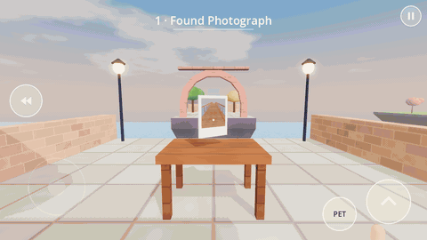

| The Station (hub) | A found photo becomes a real bridge | A tower photographed looking up becomes a tunnel |
|---|---|---|
| 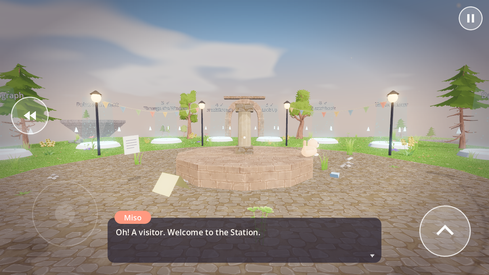 | 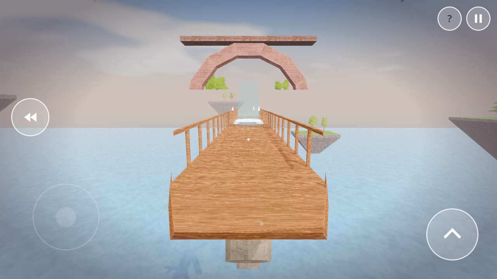 | 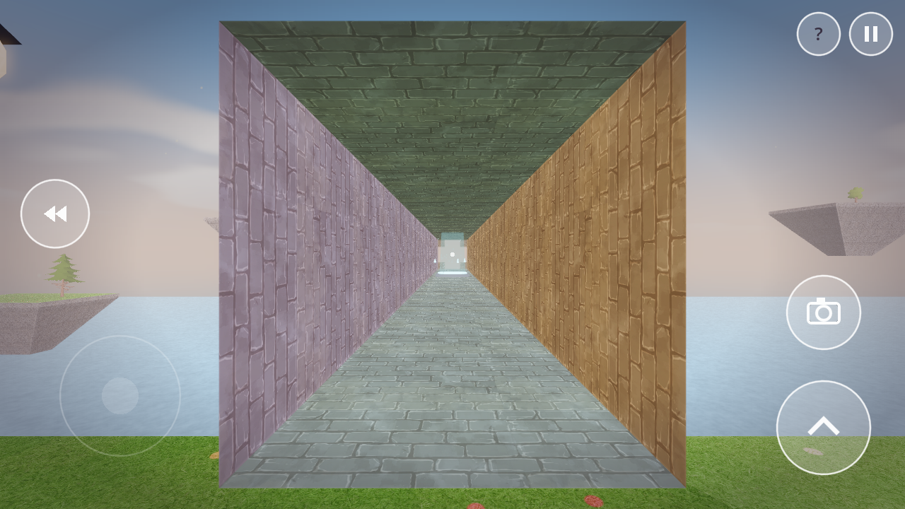 |
| 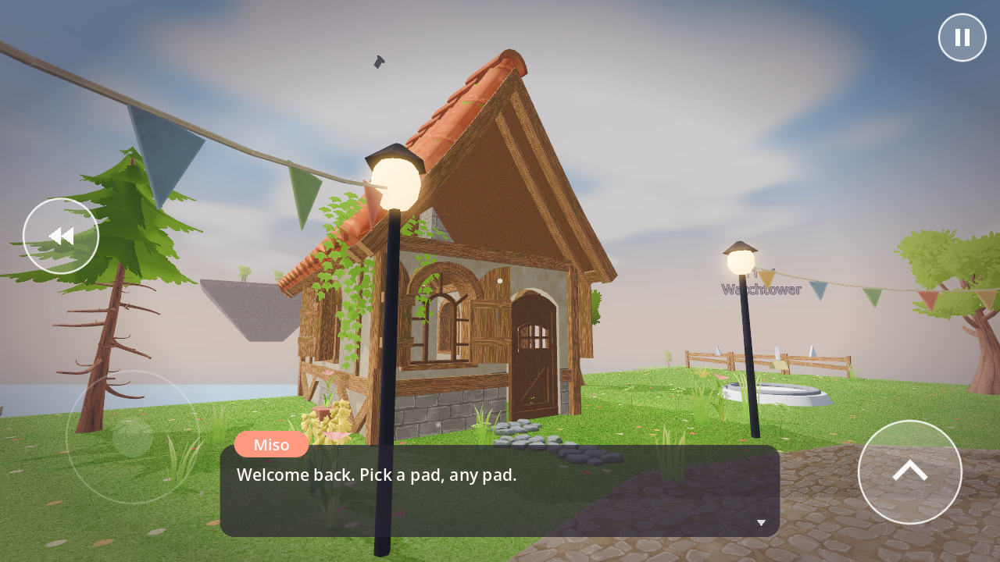 | 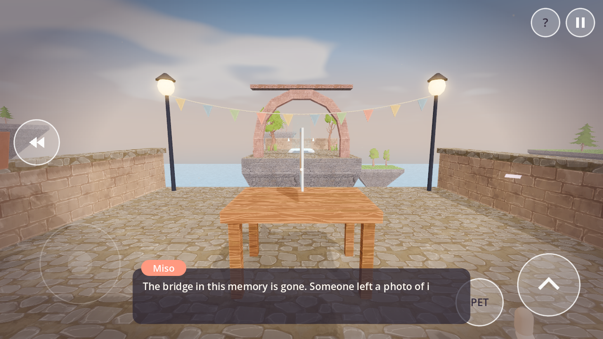 | 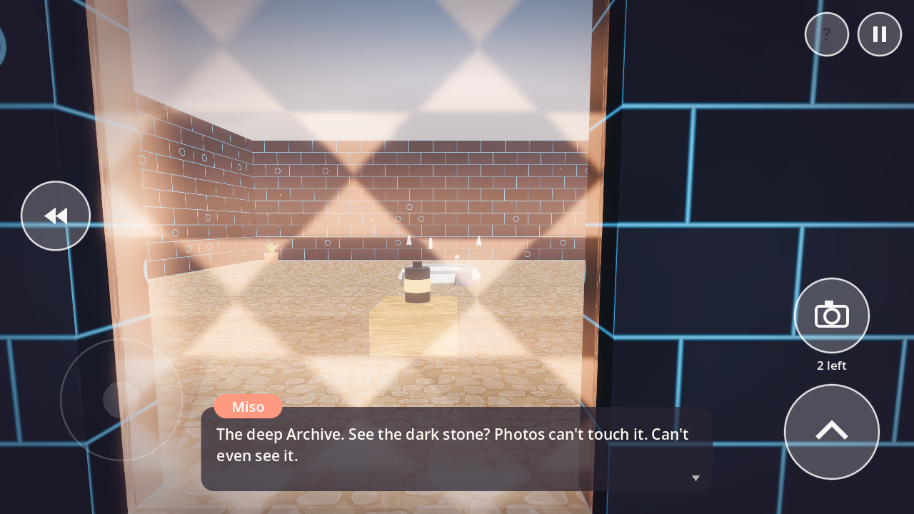 |
| **A pencil sketch stays a sketch** | **A watercolour stays a painting** | **Holding up a found photo** |
| 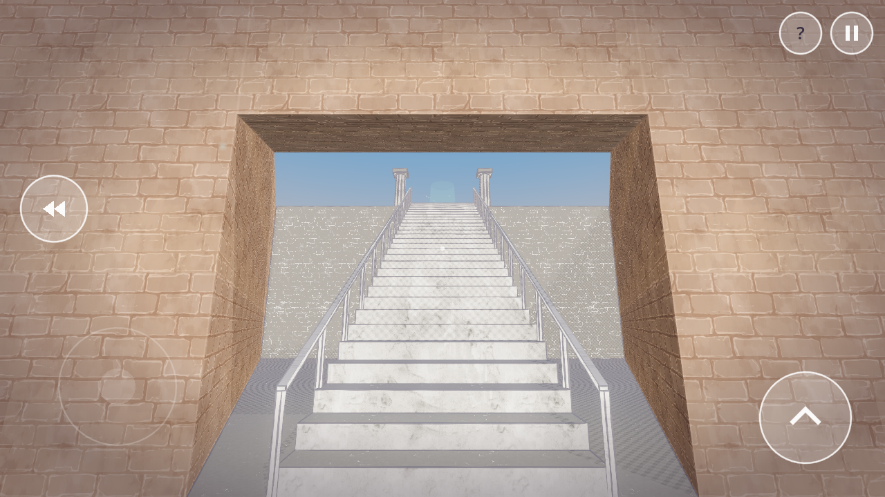 | 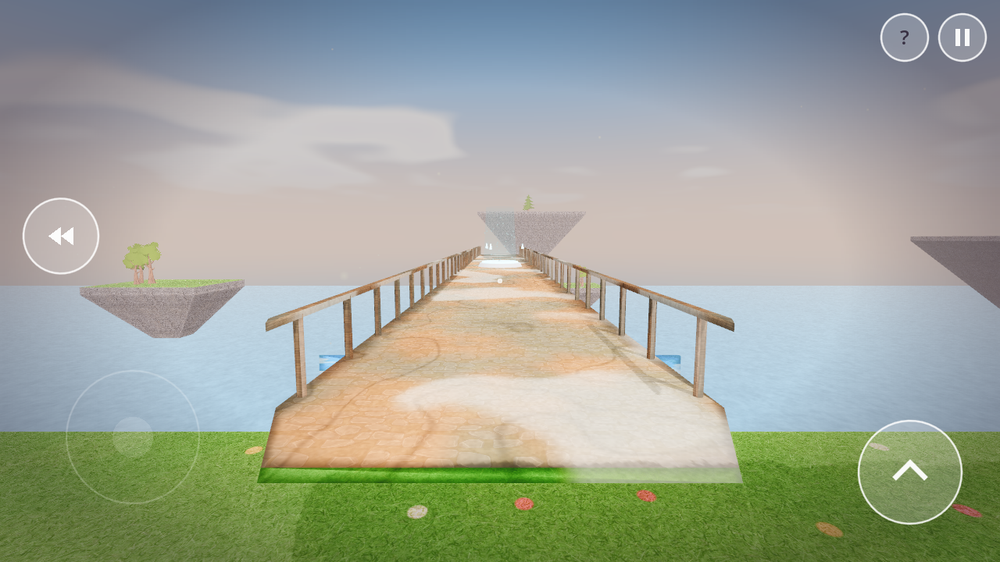 | 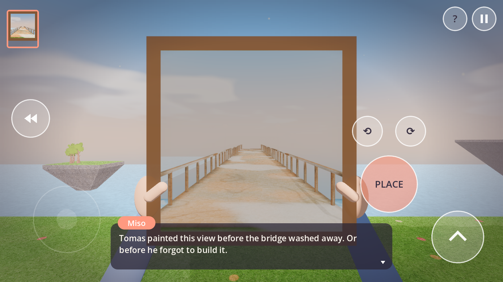 |
| **Main menu over the live island** | **Every level is dressed** | **A keepsake when a memory is restored** |
| 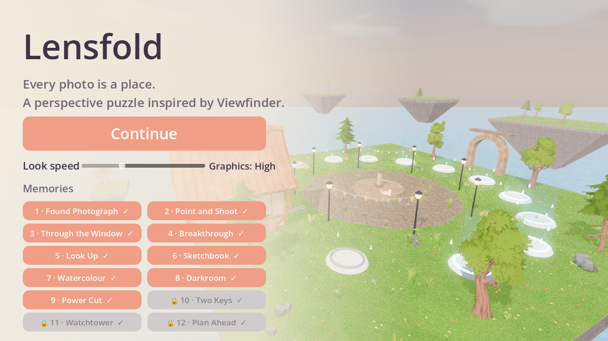 |  | 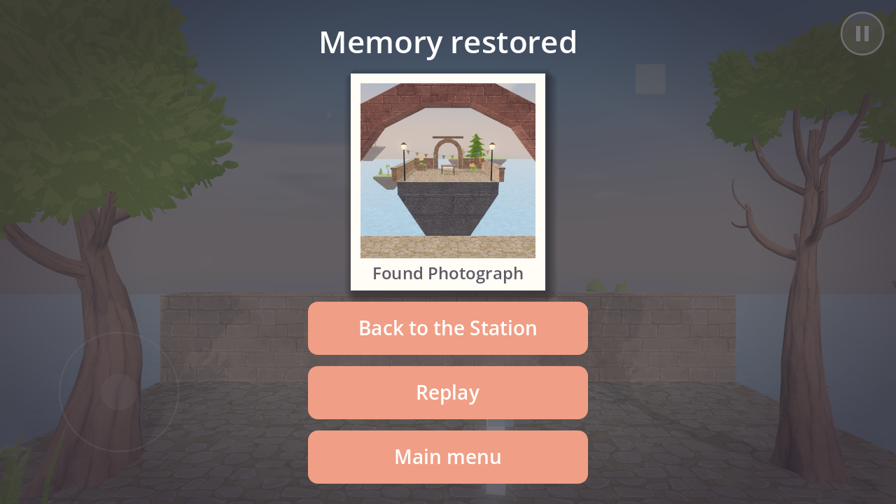 |
| **Chapter 2: a battery behind an energy gate** | **Which camera? The tall mast or the ground?** | |
|  | 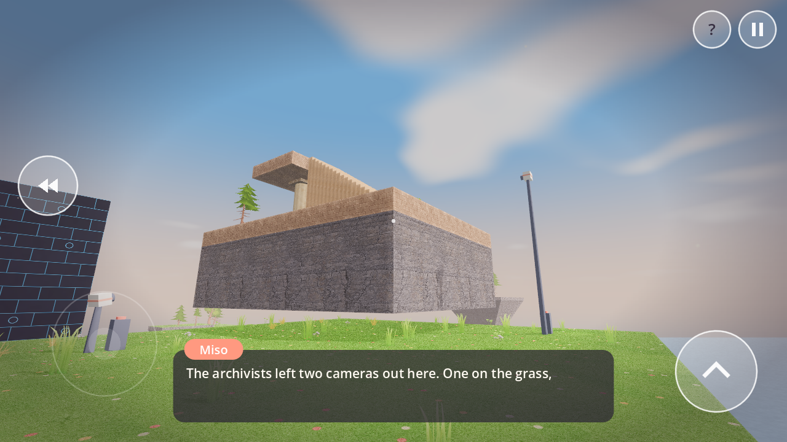 | |

## Features

**The core mechanic**
* **Photo → geometry.** A real-time convex-polyhedron slicer cuts the world along
  the photo frustum. Placing a photo deletes everything inside its frame (to the
  horizon) and pastes the captured geometry, collision included. Trees, arches,
  stairs and houses are sliced too.
* **Textures travel with geometry.** Every face carries its own texture frame, so
  bricks, planks and tiles stay glued to a pasted piece of world.
* **Art styles survive placement**, as in Viewfinder. A found **pencil sketch**
  becomes 3D line art on paper, a **watercolour** becomes painted geometry with
  pigment blooms, and an old postcard comes out in **sepia**.
* **Instant camera** with a viewfinder overlay (frame guides, REC dot,
  level/vertical indicator). Some levels give you limited film.
* **Polaroid feel:** the shutter clicks, the picture ejects with a motor whirr,
  develops from white, sways in your hand, and swells out past the screen edges
  when you place it.
* **Copy objects:** photograph a battery to duplicate it. Rotate photos in 90° steps.
* **Rewind:** hold REWIND to scrub time backwards, with a VHS-style effect. It
  undoes placements, pickups and falls.

**Polish & feel**
* Hands hold the picture up, and the camera has head-bob, footsteps and a
  landing dip. The bob never shifts where a photo lands.
* Living world: trees sway in the wind, pollen drifts, birds circle overhead,
  butterflies flutter, and wind and birdsong play in the background.
* Detailed surfaces: flowers and clover in the grass, moss in tile grout,
  cracked tiles, weathered bricks, nailed planks, lichen on rock, and soft bevel
  highlights on every edge.
* Set dressing in every level: flower beds, bunting, picket fences, stepping
  stones, wall copings, shuttered windows, potted plants, rock clusters, and
  photos drying on a line in the darkroom.
* Teleporters with orbiting runes, rising sparkles and a positional hum.
* The main menu floats over the live Station island. Restoring a memory gives
  you a polaroid keepsake of the place.

**Chapter 2 — harder, multi-step puzzles**
* **Archive stone:** dark glowing walls that photos can't cut, copy or even
  see, so puzzles can't be skipped by cutting through walls.
* **Power sockets and energy gates:** a battery in a socket holds a gate open,
  and a socketed battery isn't powering the teleporter.
* **Fixed cameras** on masts take photos from heights you can't reach. Photos
  keep things at the same height relative to the camera, so which camera you
  use matters.
* **Photocopiers** duplicate a held photo, including any batteries in it.
* **Tilted placement:** hold a photo tilted up and a bridge becomes a ramp.
* Levels 9–12 (Power Cut, Two Keys, Watchtower, Plan Ahead) each need a plan.
  Careless placement erases what you need, and film and photos run out.
* **Hints on demand:** Miso sets the scene but doesn't give answers. Tap **?**
  (or pet her) for hints that go from a nudge to the full solution.

**The world**
* **The Station:** a hub island with a fountain and a portal pad for each memory.
  Locked and completed states are shown above each pad.
* **Miso the cat:** a companion who lounges around each level, watches you,
  talks you through puzzles, and purrs (with hearts) when you pet her.
* **Archivist notes** to read, telling a small original story about the people
  who built the Archive.
* **12 handcrafted levels** in two chapters. Chapter 1: Found Photograph, Point and Shoot,
  Through the Window, Breakthrough, Look Up, Sketchbook, Watercolour, Darkroom. Chapter 2:
  Power Cut, Two Keys, Watchtower, Plan Ahead.
* A pastel look: procedural materials (grass, stone tiles, brick, planks, roof
  shingles, rock, foliage, water), soft half-lambert lighting with lifted
  shadows, glow, a painted sky with drifting clouds, floating islands on the
  horizon and a sea below. The horizon is a backdrop that photos never cut, like
  a skybox.
* **All audio is synthesised at runtime:** an ambient music loop, the shutter,
  photo eject, placement whoosh, chimes, rewind and purring. The APK ships no
  audio files.

**Mobile**
* Touch-first multi-touch HUD with a floating joystick, drag-to-look, and
  context buttons (GRAB / DROP / READ / PET). Keyboard and mouse also work.
* **Compatibility (GLES3) renderer.** The level is one batched mesh and draw
  call. Per-solid mesh and collision caches mean a placement only rebuilds the
  pieces it cut. Jolt physics.

## Controls

| Action | Touch | Desktop |
|---|---|---|
| Move | left half of screen (floating stick) | WASD |
| Look | drag on the right half | mouse drag |
| Jump | JUMP | Space |
| Grab / drop · read note · pet Miso | context button | E |
| Camera mode / take photo | CAM, then SNAP | C, then F |
| Hold up photo *n* | tap its thumbnail (top-left) | 1–9 |
| Place held photo | PLACE | F |
| Rotate photo | ⟲ ⟳ | Z / X |
| Rewind | hold REW | hold R |
| Hint | ? | H |
| Pause | II | Esc |

Tip: placement snaps to the photo's original pitch, to level, or to the 90° grid
when you're within a few degrees, so near-misses still line up.

## Project layout

```
project.godot            Godot 4.7, GL Compatibility, landscape, Jolt physics
export_presets.cfg       Android preset (arm64-v8a, immersive, com.lensfold.game)
scenes/main.tscn         entry scene (menu <-> level flow in scripts/main.gd)
scripts/geometry/        Solid (convex polyhedron + texture frames), Slicer (clip/capture/carve/place),
                         SolidWorld (cached batched mesh + collision), Mat (material & art-style ids),
                         ModelLib (imported models -> sliceable triangle-soup solids)
scripts/game/            Game (photos, rewind, items, hub), Player, Battery, Teleporter, PhotoPickup, Photo,
                         Cat (Miso), Note, Sfx (synthesised audio), Progress (save)
scripts/levels/          levels.gd (hub + 12 levels), props.gd (trees, arches, stairs, houses, islands…)
scripts/ui/              Hud (touch controls, viewfinder, tray, dialogue, notes), MainMenu
assets/                  CC0 models (nature/, village/) and painted textures, prepared by tools/prepare_assets.py
shaders/prop.gdshader    textured models: alpha-cut leaves, wind sway, art styles
shaders/world.gdshader   painted textures + procedural materials + sketch / watercolour / sepia styles + soft lighting
shaders/sky.gdshader     painted sky with clouds
tests/                   slicer unit tests, full scripted playthrough, screenshot harness
tools/apksigner/         optional apksigner drop-in for headless/CI APK builds
```

## Building the Android APK

### With the Godot editor (normal workflow)

1. Install **Godot 4.7.x** and, from *Editor → Manage Export Templates*, the
   matching export templates.
2. Install the Android SDK (Android Studio, or the command-line tools with
   `platform-tools` and `build-tools`), plus JDK 17 or newer.
3. In *Editor Settings → Export → Android*, set the **Android SDK path** and
   **Java SDK path**. Godot creates a debug keystore automatically.
4. Open this folder as a project, then *Project → Export… → Android → Export
   Project* to get `build/lensfold.apk`. Or plug in a phone with USB debugging
   on and use the one-click deploy button.

For a **release** build, create your own keystore (`keytool -genkeypair …`) and
fill in *Keystore → Release* in the preset. Never commit a keystore.

### Headless / CI (no Android SDK download needed)

```bash
# 1. a minimal SDK whose only real tool is an apksigner drop-in (Google's apksig library)
tools/apksigner/setup_minimal_sdk.sh "$HOME/android-sdk"
# 2. a debug keystore
keytool -genkeypair -keystore debug.keystore -alias androiddebugkey \
  -storepass android -keypass android -keyalg RSA -validity 10000 -dname "CN=Android Debug"
# 3. tell Godot where things are, then export
export GODOT_ANDROID_KEYSTORE_DEBUG_PATH=$PWD/debug.keystore \
       GODOT_ANDROID_KEYSTORE_DEBUG_USER=androiddebugkey \
       GODOT_ANDROID_KEYSTORE_DEBUG_PASSWORD=android
#    (and set export/android/android_sdk_path + java_sdk_path in editor_settings-4.7.tres)
godot --headless --path . --export-debug "Android" build/lensfold-debug.apk
```

The drop-in signs with **APK Signature Scheme v2**, which is valid for every
device the APK supports (Godot 4.7's minimum is Android 7.0 / API 24). The
exported debug APK is about 28 MB (arm64-v8a, minSdk 24, targetSdk 36).

## Tests

```bash
godot --headless --path . --script res://tests/test_slicer.gd                   # geometry unit tests
godot --headless --fixed-fps 60 --path . res://tests/level_playthrough.tscn      # solves all 12 levels, checks wrong moves fail, rewind, hub
xvfb-run godot --path . --rendering-driver opengl3 res://tests/screenshots.tscn -- /tmp/shots
# record the scripted gameplay run (PNG frames + WAV) with Movie Maker:
xvfb-run godot --path . --rendering-driver opengl3 --write-movie /tmp/rec/frame.png --fixed-fps 30 res://tests/record_gameplay.tscn
```

The playthrough test drives the real player physics, slicer, battery copying,
teleporter sockets, sketch/painting styles, the hub pads and rewind, and checks
that every level can be completed. It also checks that the obvious wrong
moves fail, so Chapter 2 can't be cheesed (74 checks).

## How close is it to the original?

The mechanics, structure and feel follow Viewfinder closely: photos that become
geometry, found pictures in their own art styles, an instant camera with limited
film, battery copying, teleporters, rewind, a hub of memories, a cat companion,
and notes from the people who built the world. **The assets are not
Viewfinder's.** Its models, textures, music, story and exact level layouts are
copyrighted by Sad Owl Studios, so everything here is original work in a similar
pastel style.

## Ideas for more content

A photocopier that duplicates photos, colour filters that make some geometry
solid, fixed security cameras that take the photo for you, timed rooms, more
hubs, and haptics (`permissions/vibrate` is already enabled).
