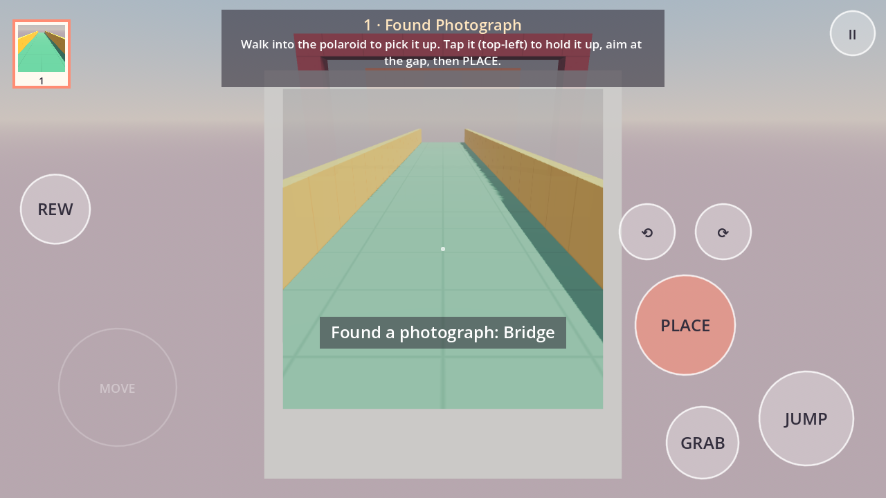

# Lensfold: a Viewfinder-style photo puzzle game for Android (Godot 4.7)

Hold up a photograph, line it up with the world, and it **becomes** the world.
*Lensfold* is a fan-made homage to Sad Owl Studios' **Viewfinder**, rebuilt from
scratch in Godot 4.7 for Android phones and tablets. Viewfinder has no official
mobile release.

> **Name & assets.** All code, levels and art here are original. No Viewfinder
> assets are used. The game is called "Lensfold" because "Viewfinder" is Sad Owl
> Studios' / Thunderful's trademark. Don't publish it on a store under that name.

See **[docs/RESEARCH.md](docs/RESEARCH.md)** for the research on the original
game and how its mechanic works.

| Hold up a found photo… | …and it becomes a bridge | A tower photographed looking up, placed as a tunnel |
|---|---|---|
|  |  |  |

## Features

* **Photo → geometry.** A real-time convex-polyhedron slicer cuts the world along
  the photo frustum. Placing a photo deletes everything inside its frame (to the
  horizon) and pastes the captured geometry, collision included.
* **Instant camera** with a viewfinder overlay that matches the photo frame
  exactly. Some levels give you limited film.
* **Found photos and postcards** that show places that don't exist in the level.
* **Copy objects:** photograph a battery to duplicate it.
* **Rotate photos** in 90° steps before placing them.
* **Rewind:** hold REWIND to scrub time backwards, undoing photo placements,
  pickups and falls. Falling off the world rewinds automatically.
* **Teleporters** powered by batteries.
* **6 handcrafted levels**, each teaching one idea. Progress is saved.
* **Touch-first HUD** with multi-touch: a floating joystick on the left, drag to
  look on the right, and buttons for JUMP, GRAB, CAM/SNAP, PLACE, rotate and REW.
  Keyboard and mouse also work on desktop.
* Mobile-friendly rendering: **Compatibility (GLES3) renderer**, the whole level
  in one batched draw call, a pastel shader with world-space tiling, and Jolt
  physics.

## Controls

| Action | Touch | Desktop |
|---|---|---|
| Move | left half of screen (floating stick) | WASD |
| Look | drag on the right half | mouse drag |
| Jump | JUMP | Space |
| Grab / drop battery | GRAB | E |
| Camera mode / take photo | CAM, then SNAP | C, then F |
| Hold up photo *n* | tap its thumbnail (top-left) | 1–9 |
| Place held photo | PLACE | F |
| Rotate photo | ⟲ ⟳ | Z / X |
| Rewind | hold REW | hold R |
| Pause | II | Esc |

Tip: placement snaps to the photo's original pitch, to level, or to the 90° grid
when you're within a few degrees, so near-misses still line up.

## Project layout

```
project.godot            Godot 4.7, GL Compatibility, landscape, Jolt physics
export_presets.cfg       Android preset (arm64-v8a, immersive, com.lensfold.game)
scenes/main.tscn         entry scene (menu <-> level flow in scripts/main.gd)
scripts/geometry/        Solid (convex polyhedron), Slicer (clip/capture/carve/place), SolidWorld (batched mesh + collision)
scripts/game/            Game (photos, rewind, items), Player, Battery, Teleporter, PhotoPickup, Photo, Progress (save)
scripts/levels/levels.gd the 6 levels, built procedurally from boxes and ramps
scripts/ui/              Hud (touch controls, viewfinder, tray), MainMenu
shaders/world.gdshader   pastel vertex-colour + grid shader
tests/                   slicer unit tests, full scripted playthrough, screenshot harness
tools/apksigner/         optional apksigner drop-in for headless/CI APK builds
```

## Building the Android APK

### With the Godot editor (normal workflow)

1. Install **Godot 4.7.x** and, from *Editor → Manage Export Templates*, the
   matching export templates.
2. Install the Android SDK (Android Studio, or the command-line tools with
   `platform-tools` and `build-tools`), plus JDK 17 or newer.
3. In *Editor Settings → Export → Android*, set the **Android SDK path** and
   **Java SDK path**. Godot creates a debug keystore automatically.
4. Open this folder as a project, then *Project → Export… → Android → Export
   Project* to get `build/lensfold.apk`. Or plug in a phone with USB debugging
   on and use the one-click deploy button.

For a **release** build, create your own keystore (`keytool -genkeypair …`) and
fill in *Keystore → Release* in the preset. Never commit a keystore.

### Headless / CI (no Android SDK download needed)

```bash
# 1. a minimal SDK whose only real tool is an apksigner drop-in (Google's apksig library)
tools/apksigner/setup_minimal_sdk.sh "$HOME/android-sdk"
# 2. a debug keystore
keytool -genkeypair -keystore debug.keystore -alias androiddebugkey \
  -storepass android -keypass android -keyalg RSA -validity 10000 -dname "CN=Android Debug"
# 3. tell Godot where things are, then export
export GODOT_ANDROID_KEYSTORE_DEBUG_PATH=$PWD/debug.keystore \
       GODOT_ANDROID_KEYSTORE_DEBUG_USER=androiddebugkey \
       GODOT_ANDROID_KEYSTORE_DEBUG_PASSWORD=android
#    (and set export/android/android_sdk_path + java_sdk_path in editor_settings-4.7.tres)
godot --headless --path . --export-debug "Android" build/lensfold-debug.apk
```

The drop-in signs with **APK Signature Scheme v2**, which is valid for every
device the APK supports (Godot 4.7's minimum is Android 7.0 / API 24). The
exported debug APK is about 28 MB (arm64-v8a, minSdk 24, targetSdk 36).

## Tests

```bash
godot --headless --path . --script res://tests/test_slicer.gd                   # geometry unit tests
godot --headless --fixed-fps 60 --path . res://tests/level_playthrough.tscn      # solves all 6 levels + rewind
xvfb-run godot --path . --rendering-driver opengl3 res://tests/screenshots.tscn -- /tmp/shots
```

The playthrough test drives the real player physics, slicer, battery copying,
teleporter sockets and rewind, and checks that every level can be completed.

## Ideas for more content

Paintings and drawings with their own art style (a different shader per photo),
a photocopier that duplicates photos, colour filters that make some geometry
solid, fixed security cameras that take the photo for you, a hub world, Cait the
cat, and sound/haptics (`permissions/vibrate` is already enabled).
